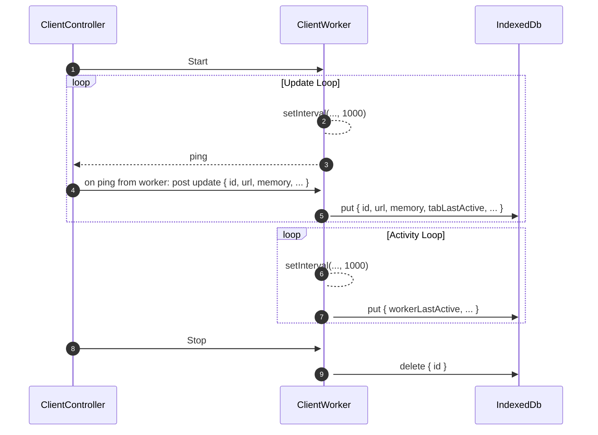
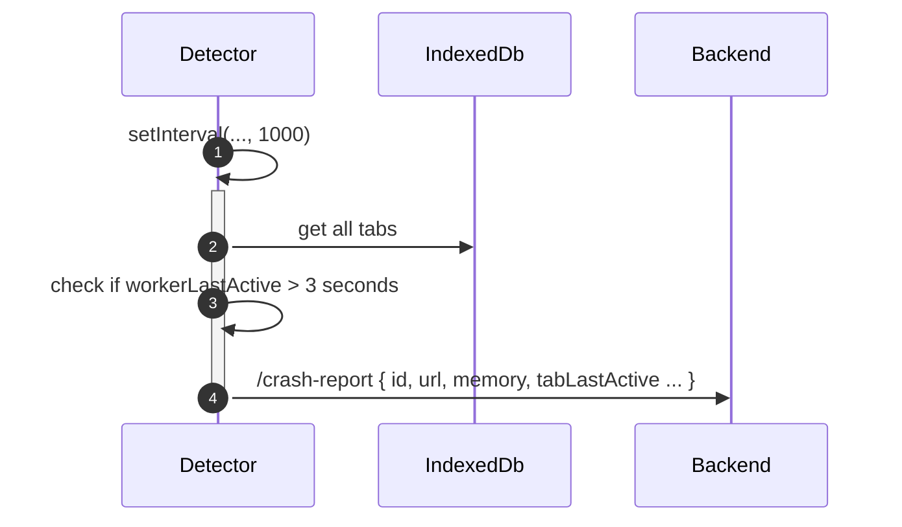

# Detecting Browser/Tab crashes POC

This POC shows how browser crashes could potentially be detected.

## How to run it

1. Run `node ./server.js`
2. Open http://localhost:1234
3. You can open multiple tabs (each tab will get a unique name)
4. Logs are sent to the terminal via server.js
5. Try various actions that can simulate a crash
6. Once a crash is detected it will be sent to the server and stored in local memory
7. http://localhost:1234 will show crashes that were reported 

## Resources

1. https://github.com/getsentry/sentry-javascript/issues/5280
2. http://jasonjl.me/blog/2015/06/21/taking-action-on-browser-crashes/
3. https://medium.com/@JackPu/how-to-check-browser-crash-via-javascript-fa7d5af5e80b

## Tested approaches

1. Detecting crashes before they occur
2. Track and persist state of tabs (last alive ping + if it was closed properly). Send crash reports based on the state.

### Detecting crashes before they occur 

The idea was to check if the page becomes unresponsive or is very close to hitting memory limits and report it over HTTP to persisted storage.

The tab may be near crash when:

1. Memory usage can be checked with `window.performance.memory`
  - Pros:
    - It provides total JS heap size, used heap size and the limit
  - Cons:
    - Browser may dynamically change limits and allocate additional memory
    - Available only in Chrome
2. When browser slows down. This could be checked by a ping mechanism using web/service workers.
   - Pros:
     - Available in all browsers
   - Cons:
     - When only one tab is opened and crashes the service worker may be killed immediately and there might be not enough time to ensure it manages to send a report about the crash. Based on some experiments only Firefox keeps the worker alive a bit longer.

I wasn't able to get reliable, consistent results with this approach

### Track and persist state of tabs

The idea is to track active tabs and last active pings + stop tracking when tab closes correctly. Based on that info if the tab stopped sending pings + it was not closed correctly we assume it's frozen or crashed.

Detection would consist of following components:

1. Storage to keep information about active tabs
2. Client code used to periodically report the state of a tab to the storage
3. Detection logic that periodically checks the state of storage

### POC

In the POC following approaches were considered:

1. Storage
   - Browser local storage:
     - pros: easy to use
     - cons: can lead to incorrect state when multiple tabs access it at the same time (https://html.spec.whatwg.org/multipage/webstorage.html#introduction-15): "(...) authors are encouraged to assume that there is no locking mechanism (...)"
   - Browser session storage
     - cons: used by Sentry (see resources) but it's isolated to a single tab so to make it work it would require user to refresh the tab (not close it) after the crash which may not happen every time (https://developer.mozilla.org/en-US/docs/Web/API/Window/sessionStorage) 
   - Browser indexed db
     - pros: can be shared between workers and allows transactional updates 
   - External storage (over HTTP): 
     - cons: will stop reporting when the user if offline though the tab may not crashed

Choice: IndexedDB

2. Client code to periodically report the state (ping + closing)
   - setInterval inside the tab thread
     - cons: when tab is inactive setInterval gets deprioritized and will be executed less frequently
   - setInterval inside service/web worker thread
     - pros: when a message is sent the inactive/invisible tab can respond immediately

Choice: setInterval inside a service/web worker

3. Client code to save state to storage

- save inside the tab thread
    - cons: debugging the page will stop the thread and detector could say it crashed
- save inside service/web worker
    - pros: worker will keep working even if the tab is paused;

Choice: Save inside a web worker

A caveat is that Firefox doesn't kill the web worker immediately when tab crashes. This could lead to scenario when the detector thinks that the tab is still alive. At the same time we need to track the time tab was last active. To mitigate it we can keep both: last time the tab was active (for reporting) and last time the worker was active (to detect crashes).

3. Detection logic
   - In a service/shared web worker
     - cons: can be a single instance running independently to tabs

Choice: Use shared web worker. In theory it should work with a service worker as well though based on experiments service worker may be killed when tab crashes, while shared web workers seems to keep running.

### 

1. Client code executes in the same thread as the main app. It's responsible for starting the update loop in the worker.
2. WebWorker starts the loop with setInterval. This is done in the worker to avoid slowing down setInterval on inactive tabs
3. WebWorker pings the client for the data (WebWorker have no access to url, memory usage, etc.)
4. WebWorker save the data with tabLastActive timestamps to the IndexedDB when receives a message from the tab. Saving is done in the worker to ensure it's a separate thread in cases the Client thread is paused because of debugging.
4. WebWorker saves workerLastActive timestamp every second
5. When Client is unloaded properly it sends the message to the WebWorker to remove the entry from IndexedDb

A separate process check for stale tabs and reports back to the backend. It connects to the same IndexedDB

workerLastActive timestamp is used to detect actual crash of a tab and tabLastActive is used for reporting. They may be out of step in Firefox which keeps the worked active after the tab crashes OR when thread on the tab is paused due to debugging (web worker will keep running)