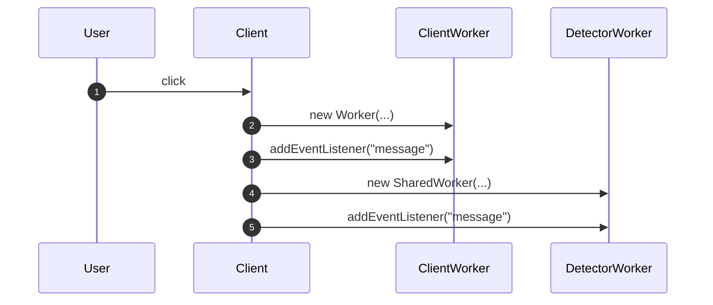
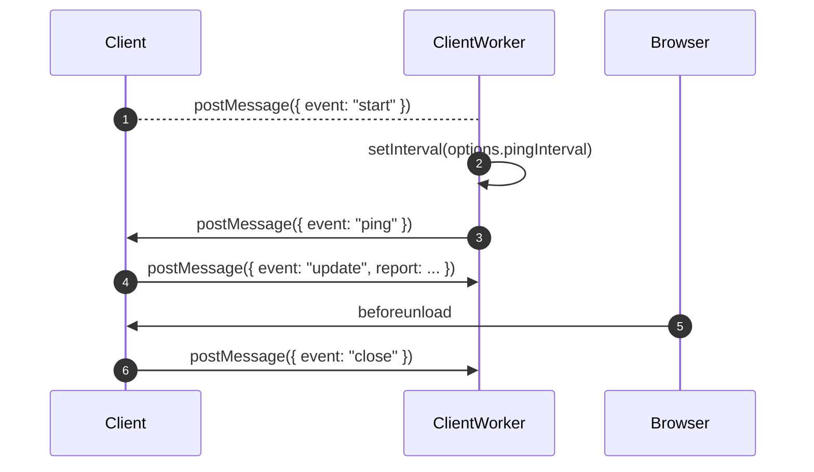
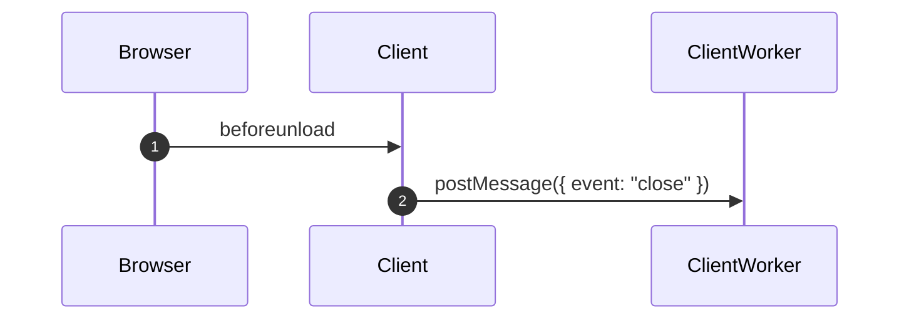
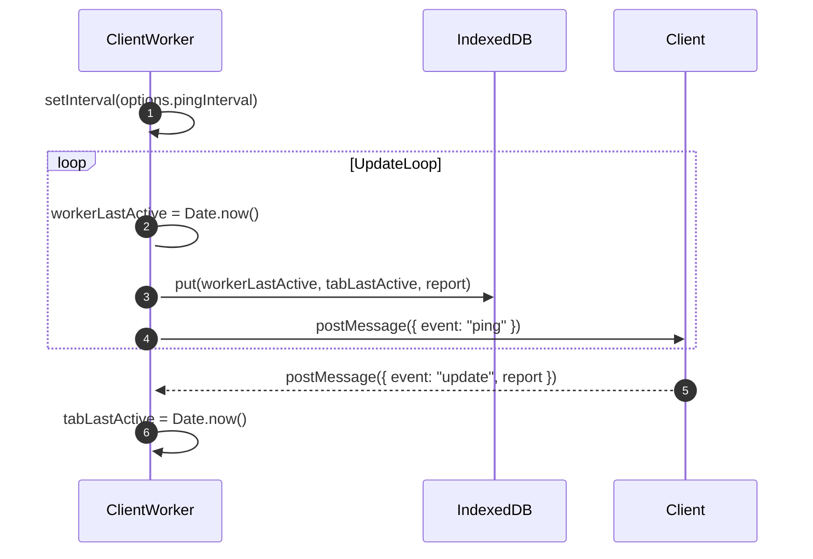
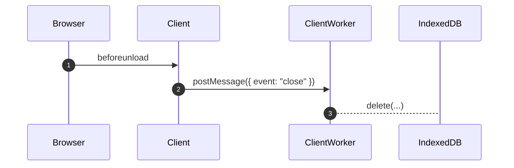
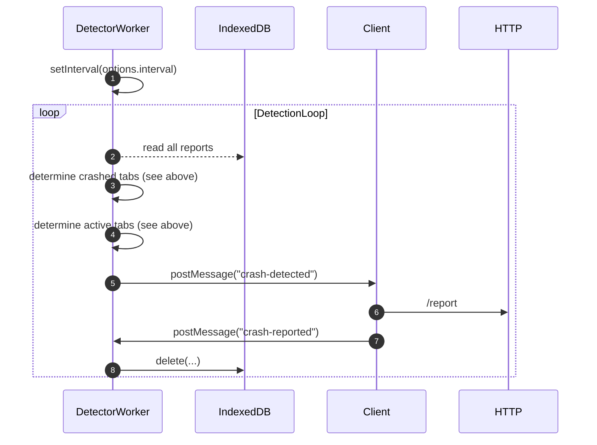

# Client (main thread)

Client code (main thread of the tab). Responsibilities:
- Workers initialization
- Sending updates about the tab to web worker (see below)
- Sending close event to web worker when the tab is closed by the user
- Handling crash reports

## Workers initialization

(1) Crash detection is activated on click because it relies on `beforeunload` event which is not dispatched when user does not interact with tha page (ie. [sticky activation](https://developer.mozilla.org/en-US/docs/Glossary/Sticky_activation)).

## Sending updates about the tab

(2) (3) Worker sends pings on regular interval. Worker is responsible for sending pings because client code may not be able to run code on regular basis:
- setInterval may be deprioritized when tab is inactive
- setInterval may not be triggered when code is paused due to debugging

Putting "pinging" logic in the web worker helps mitigate above issues.

(4) Client code sends report about current tab (like URL, memory usage) to the worker for saving

## Sending close event

The tab is marked as successfully closed when:
- user closes the tab/browser
- user navigates to a different page

# Client Web Worker

Client Web Worker is responsible for:
- Sending "pings" to the main thread (client), and saving received state report of the tab (e.g. URL, memory usage)

## Saving ping updates

(2) `workerLastActive` is updated on regular interval calls and stored along with current data to the db (3)

(4) Ping is sent at the end of the loop, but since it's asynchronous communication the update may happen outside of the loop:

(5) Tab send the update

(6) `tabLastActive` is updated, and will be stored on the next update loop

Note: Saving could also happen here but it'd be duplicated since it has to happen in the main UpdateLoop anyway. This is because UpdateLoop will always happen while "ping" update from the tab may not happen when the tab is being debugged.

## Removing state of the tab

# Detector  Worker

Detector Worker (Shared Worker) is responsible for:
- Reading current state of all tabs to determine which one crashed and sending a crash report to client so it can be stored externally

Detector's logic:

The tab is active when `workerLastActive` is very close to Date.now(). `tabLastActive` is not reliable to determine it as the tab may be debugged and `tabLastActive` freezes for time being.

If the tab was closed successfully the report simply won't be in the database.

The tab is detected as crashed when `workerLastActive` is old when compared to Date.now(). It means the web worker stopped working but since the report is in the database in means the page was not closed correctly so it probably crashed.

(4) (5) crash reports are sent only to one active tab to avoid duplicates

(8) state is removed from the db only after successful report to ensure it was sent out